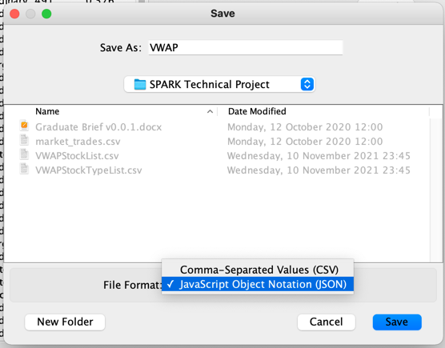
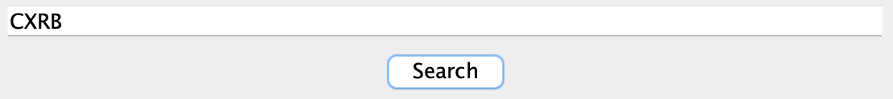
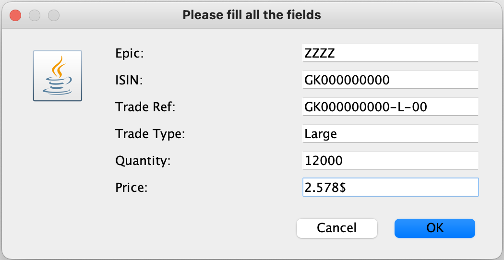
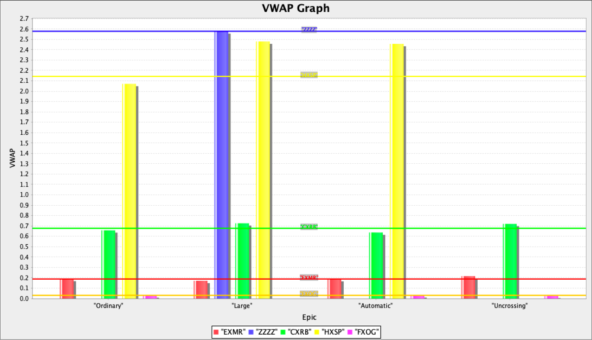

# Winterflood Take-Home Assessment (VWAP)

## Objective 1
Read a .csv file and calculate the Value Weighted Average Price (VWAP) for:
* Each unique stock
* Each unique stock / trade type combination

The given .csv file [market_trades](https://github.com/ojawolesi/WinterfloodTechnical/blob/main/market_trades.csv) has the following format:  

| epic | isin | trade ref | trade type | quantity | price |
|------|------|-----------|------------|----------|-------|
|CXRB|GK8838181522|GK8838181522-O-013|Ordinary|2|0.7205|
|CXRB|GK8838181522|GK8838181522-O-02|Ordinary|491|0.576|
|...|...|...|...|...|...|

## Objective 2
Allow users to save the VWAP calculations in 2 separate files. The VWAP calculations were saved in the following format for the unique stock and the unique stock / trade type combination.

| epic | VWAP |  
|------|-------| 
|EXMR|0.18806396976625700| 
|CXRB|0.6769488220931830|  
|...|...|...|...|...|...|  

| epic | trade type | VWAP |
|------|------|-----------|
|EXMR|Ordinary|0.1901579094882740|
|EXMR|Large| 0.171|
|...|...|...|

## Objective 3
Allow users the chance to save the VWAP calculations in a file format other than the first (.csv). I chose a .json file, as this would be suitable for web APIs and automation.

| .csv or .json saving option |
|------|
|

## Objective 4
Allow users to filter table results, as well as input trade records. Users should also be able to view this in an innovative way.

Filtering | Input of trades
:-------------------------:|:-------------------------:
  |  

| Display in an innovative way |
|------|
|

## Objective 5
The other data/calculations that might be of interest apart from VWAP are:
* Calculate the percentage of a stock that a unique stock / type has been traded  
* Calculate the percentage all trades that a unique stock has been traded 
* The standard deviation of trades within a unique/stock combination 
    * could also have been expressed via a box and whisker plot of the dataset 

## Objective 6
Aspects of the data that struck me include:
* HXSP had a very high price average price and across the unique stock / type where it had been traded it maintained its greater comparative price 
* FXOG had a very high price
* The data did not include any time, which I assume real-world data would as to track moving prices

| Stock/Type View |
|------|
|